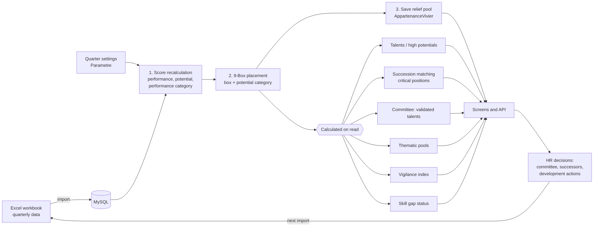
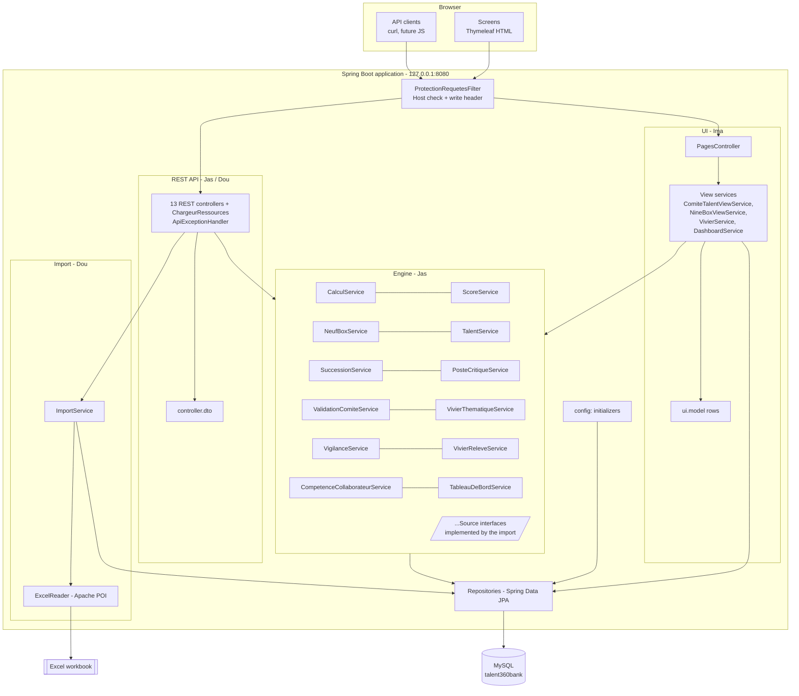
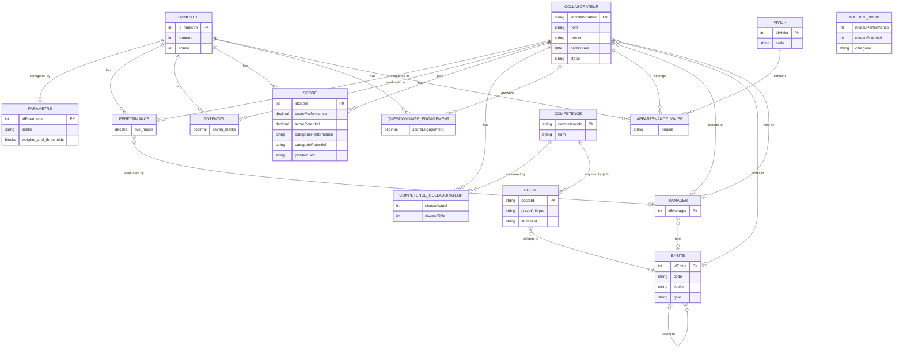
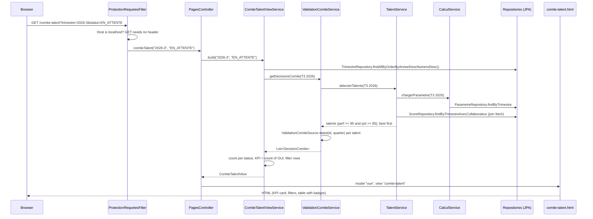
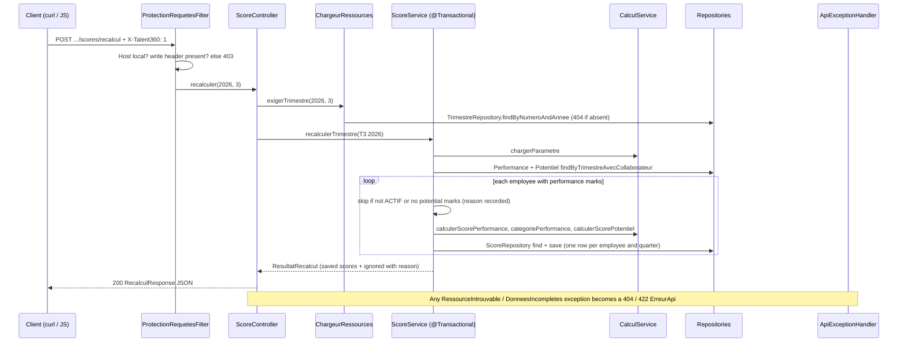

# TALENT 360 BANK — Developer Guide

This guide explains the whole project: what it is for, how it is built, how the calculations work, how to run it, and what is still missing. It describes the code on `develop` as of commit `d5b7548` (pull request #21). Where the project is incomplete, the guide says so.

The detailed business formulas, with every default value and workbook column, are in [`moteur-de-calcul.md`](moteur-de-calcul.md) (French). How a screen must send write requests is in [`requetes-ecriture.md`](requetes-ecriture.md).

---

## Contents

1. [The project](#1-the-project)
2. [Functional view](#2-functional-view)
3. [Architecture](#3-architecture)
4. [Tech stack](#4-tech-stack)
5. [Data model](#5-data-model)
6. [The calculation engine](#6-the-calculation-engine)
7. [Key design choices](#7-key-design-choices)
8. [Request lifecycle](#8-request-lifecycle)
9. [Security](#9-security)
10. [How to run](#10-how-to-run)
11. [Git workflow](#11-git-workflow)
12. [Current status and what's left](#12-current-status-and-whats-left)
13. [Glossary](#13-glossary)

---

## 1. The project

### Context

TALENT 360 BANK is a talent-management application for a bank's HR department.

- **Offline and single-workstation ("monoposte").** It runs on one HR workstation, against a local MySQL database. It is not a web service for many users.
- **One HR user.** There is no user management today.
- **Sensitive personal data.** It holds employee records (identity, birth date, evaluations, engagement). This drives the security choices in [section 9](#9-security).

### The problem it solves

Every quarter, HR evaluates about a hundred employees and must answer a few questions:

- Who performs well, and who has potential? (performance and potential scores, 9-Box matrix)
- Who are our talents and high potentials? Which of them does the Talent Committee validate?
- For each critical position, do we have a successor ready, and how soon?
- Which employees are at risk of leaving, and why? (vigilance index)
- Which skills does each employee need to develop, and how urgently?

Today this is done in an Excel workbook full of formulas. The application replaces the formulas with an engine whose rules are explicit, tested and configurable.

### The client's workbook is the reference

The file `docs/data/TALENT_360_BANK_Dataset_V1.xlsx` is the specification. It is **gitignored** (it contains realistic, if fictitious, personal data), so each developer receives it separately.

| Sheet | Content |
|---|---|
| `00_PARAMETRES` | Every weight and threshold (rows 6–77) |
| `01_COLLABORATEURS` | 100 employees |
| `02_PERFORMANCE`, `03_POTENTIEL` | Evaluation marks, scores, categories |
| `04_9BOX` | 9-Box placement |
| `05_REFERENTIEL_COMPETENCES`, `06_EMPLOYEE_SKILLS` | 25 skills, 2,500 employee × skill levels |
| `07_POSTES`, `08_POSTES_CRITIQUES`, `09_SUCCESSION` | Positions, critical positions, successors and matching |
| `10_TALENTS` | Talent / high-potential flags, committee decision, thematic pool |
| `11_DEVELOPMENT_PLAN` | Development plans (not used by the engine) |
| `12_VIGILANCE` | Engagement, risk signals, vigilance index |

The rule is simple: **the engine must produce the same results as the workbook.** The test `DatasetExcelComparaisonTest` replays the workbook through the engine and compares the results column by column (see [section 7](#the-excel-comparison-test)).

---

## 2. Functional view

### Screens

| URL | Status | What HR does there |
|---|---|---|
| `/` | Working, **partly mock data** | Home dashboard: nine indicator cards. Three are real (active employees, talents, critical positions); six are hardcoded in `DashboardService` (9, 18, 1, 23, 5, 100). |
| `/9box` | Working | Sees the 3×3 matrix for the latest quarter, with the names in each box. |
| `/viviers` | Working | Sees the pool members (currently the relief pool saved by the engine) with their scores. |
| `/comite-talent` | Working | Chooses a quarter and a committee status; sees the "Talents validés (Comité)" indicator and the table of proposed talents with scores, categories, 9-Box box and a coloured status badge. |
| `/postes-critiques` | Placeholder | — |
| `/alertes` | Placeholder | — |
| `/parametres` | Placeholder | — (settings are editable through the API only; see [`requetes-ecriture.md`](requetes-ecriture.md)) |

All screens are read-only. Everything else is available through the REST API (`/api/...`), listed in [section 3](#rest-api).

### The quarterly workflow

1. **Import** the quarter's data.
   - Today only employees can be imported, through `POST /api/collaborateurs/import?cheminFichier=...`.
   - Skills, positions, evaluation marks, questionnaire answers and HR decisions are not imported yet ([section 12](#12-current-status-and-whats-left)).
2. **Create the quarter's settings** with `POST /api/trimestres/{year}/{quarter}/parametre`, which copies the workbook defaults. Adjust them with `PUT` if needed.
3. **Recalculate the scores:** `POST .../scores/recalcul`.
4. **Place employees in the 9-Box:** `POST .../9box/placement`.
5. **Save the relief pool** so the pool screen shows it: `POST .../vivier-releve`.
6. **Consult** the screens and read-only endpoints: talents, high potentials, succession, critical positions, committee, thematic pools, vigilance, skill gaps. All of these are calculated at read time with the current settings.
7. **Decide.** HR prepares the Talent Committee and succession plans from these results. The committee's decisions and the identified successors are HR inputs that come back through the import; there is no screen to enter them yet.



---

## 3. Architecture

### Layers

The application is a classic layered Spring Boot application. Each layer only calls the one below it.

| Layer | Package | Role | Owner |
|---|---|---|---|
| Entities | `entity` | JPA-mapped tables, plus the value blocks of `Parametre` (`Poids*`, `Seuils*`, `Bareme*`) and small enums stored in tables | Jas (engine settings, `Score`), Dou (reference data) |
| Repositories | `repository` | Spring Data JPA interfaces, with explicit `join fetch` queries where the engine needs related entities | Dou, Jas |
| Engine (services) | `service`, `service.enums`, `service.resultat` | All calculations. `service.resultat` holds immutable result records (`ResultatMatching`, `DecisionComite`…). | **Jas** |
| Import | `service.ExcelReader`, `service.ImportService`, `excel` | Reading the workbook | **Dou** |
| REST API | `controller`, `controller.dto` | JSON endpoints, input forms, response DTOs, error handling | Jas (engine endpoints), Dou (`CollaborateurController`, `CompetenceController`) |
| UI | `ui.controller`, `ui.service`, `ui.model`, `templates`, `static/css` | Server-rendered screens. View services assemble data; they never calculate. | **Ima** |
| Configuration | `config` | Startup initializers and the request protection filter | Jas |
| Errors | `exception` | `RessourceIntrouvableException` (→ 404), `DonneesIncompletesException` (→ 422) | Jas |



### Packages at a glance

```
com.talent360bank.talent360bank
├── Talent360bankApplication        entry point
├── config                          startup initializers + request filter
│   ├── Matrice9BoxInitializer        seeds the 9 reference boxes
│   ├── ParametreInitializer          completes settings created before a block existed
│   ├── ColonnesObsoletesInitializer  makes removed settings columns nullable (MySQL)
│   ├── VivierReleveInitializer       creates the relief pool row
│   └── ProtectionRequetesFilter      Host check + X-Talent360 header on writes
├── entity (37)                     tables, Parametre blocks, stored enums
├── repository (17)                 Spring Data JPA
├── service (20)                    engine + import
│   ├── enums (7)                     levels, signals, statuses
│   └── resultat (11)                 immutable calculation results
├── controller (13 controllers,      REST API; ChargeurRessources turns URL
│   + 3 helpers) + dto (17)           parts into entities, ApiExceptionHandler
│                                     maps exceptions to ErreurApi
├── exception (2)
├── excel (1)                       LecteurXlsx - unused (see section 12)
└── ui
    ├── controller                    PagesController
    ├── service (4)                   view services
    └── model (6)                     display rows
```

### REST API

Every write (POST, PUT, DELETE) needs the header `X-Talent360: 1` ([section 9](#9-security)). "Quarter" is always `{annee}/{numero}` in paths, or `?annee=&numero=` in query strings.

| Area | Endpoints |
|---|---|
| Settings | `GET` / `POST` / `PUT /api/trimestres/{annee}/{numero}/parametre` |
| Scores | `POST .../scores/recalcul`, `GET .../scores`, `GET /api/collaborateurs/{id}/scores` (history) |
| 9-Box | `POST .../9box/placement` |
| Talents | `GET .../talents[/{id}]`, `GET .../hauts-potentiels[/{id}]` |
| Relief pool | `GET .../vivier-releve` (calculated), `POST .../vivier-releve` (save) |
| Succession | `GET /api/postes/{posteId}/candidats[?limite=]`, `GET /api/postes/{posteId}/candidats/{id}` |
| Critical positions | `GET /api/postes-critiques`, `.../alertes`, `.../synthese`, `.../{posteId}` |
| Committee | `GET /api/comite-talent`, `GET /api/comite-talent/talents-valides` |
| Thematic pools | `GET /api/viviers-thematiques`, `GET /api/viviers-thematiques/{code}` |
| Vigilance | `GET .../vigilance[?minimum=MODEREE]`, `GET .../vigilance/{id}` |
| Skills | `GET /api/collaborateurs/{id}/competences[?annee=&numero=]` |
| Dashboard | `GET /api/dashboard/synthese` |
| Reference data (Dou) | `GET` / `POST /api/collaborateurs`, `DELETE /api/collaborateurs/{id}`, `POST /api/collaborateurs/import`, `GET` / `POST /api/competences`, `DELETE /api/competences/{id}` |

Errors always have the same JSON shape, `ErreurApi`: `{ statut, erreur, message, details }`. `ApiExceptionHandler` maps the exceptions:

| Exception | HTTP status | `erreur` |
|---|---|---|
| `RessourceIntrouvableException` | 404 | `ressource_introuvable` |
| `DonneesIncompletesException` | 422 | `donnees_incompletes` |
| Bean validation failure | 400 | `corps_invalide` |
| `ParametreInvalideException` (cross-block rule) | 400 | `reglages_invalides` |
| `IllegalArgumentException` | 400 | `argument_invalide` |
| Anything unexpected | 500 | `erreur_interne` (generic message, details only in the log) |

---

## 4. Tech stack

| Technology | Version | What it is | Why we use it | Where |
|---|---|---|---|---|
| **Java** | 17 (`java.version` in `pom.xml`) | Language and runtime | Long-term-support version required by Spring Boot 3 | Everywhere |
| **Spring Boot** | 3.5.16 | Framework that assembles Spring, an embedded web server and sensible defaults | One executable application with no separate server to install, which fits an offline workstation | `pom.xml` parent, `Talent360bankApplication` |
| Spring Framework | 6.2.19 (via Boot) | Dependency injection, transactions | Services receive their dependencies through constructors; `@Transactional` on the engine | All `@Service`, `@Component` |
| **Spring Web (MVC)** + embedded Tomcat 10.1.55 | via Boot | HTTP server, controllers, JSON (Jackson) | REST API and page routing | `controller`, `ui.controller` |
| **Spring Data JPA** + **Hibernate** 6.6.53 | via Boot | Object–relational mapping; repositories generated from interfaces | Engine code works on objects; queries are declared, not hand-written | `entity`, `repository` |
| **Bean Validation** (Hibernate Validator) | via `spring-boot-starter-validation` | Declarative constraints (`@NotNull`, `@DecimalMax`, `@AssertTrue`) | Settings are validated before saving: sums of 100, decreasing thresholds, ranges | `entity` blocks, `ParametreForm` |
| **Thymeleaf** | 3.1.x (via Boot) | Server-side HTML templates | Screens rendered on the server with no JavaScript framework; escaped output by default (`th:text`) | `src/main/resources/templates` |
| **Spring Boot DevTools** | via Boot, `optional` | Automatic restart during development | Faster development loop. Active only with the `dev` profile, and absent from the packaged jar. | `application-dev.properties` |
| **MySQL** | server 8.4 (local); driver Connector/J 9.7.0 | Relational database | Durable local storage of the quarter data and results | `application.properties` |
| **Apache POI** | 5.5.1 | Reads and writes Excel `.xlsx` files | Import the client's workbook; the Excel comparison test | `ExcelReader`, test `LecteurXlsx` |
| **Bootstrap** + Bootstrap Icons | 5.3.3 / 1.11.3, **from the jsDelivr CDN** | CSS framework and icon font | Clean, consistent screens with little custom CSS. Because the app is meant to run offline, these files should be served locally ([section 12](#12-current-status-and-whats-left)). | Templates `<link>` tags, `static/css/style.css` |
| **Maven** (wrapper `mvnw`) | — | Build and dependency tool | Reproducible build; nothing to install besides the JDK | `pom.xml`, `mvnw`, `mvnw.cmd` |
| **JUnit 5**, **Mockito**, **AssertJ** | via `spring-boot-starter-test` | Test framework, mocks, fluent assertions | Unit tests of the engine with mocked repositories | `src/test` |
| **H2** | via Boot, test scope | In-memory database in MySQL mode | Repository, JPA and integration tests run with no MySQL installed, including in CI | `src/test/resources/application.properties` |
| **GitHub Actions** | — | Continuous integration | Runs `mvnw test` on every push and pull request to `develop` | `.github/workflows/ci.yml` |

---

## 5. Data model

### Entities

| Entity (table) | Key fields | Relationships | Notes |
|---|---|---|---|
| `Collaborateur` (`collaborateur`) | `idCollaborateur` (key, workbook `Employee_ID`), `nom`, `prenom`, `sexe`, `dateNaissance`, `dateEntree`, `fonction`, `grade`, `statut` (ACTIF / INACTIF / ARCHIVE) | `entite` → `Entite` (most specific known), `manager` → `Manager` | Only `ACTIF` employees enter the calculations. `getDirection()`, `getDepartement()`, `getRegion()`, `getAgence()` walk up the `Entite` tree |
| `Entite` (`entite`) | `code` (unique: path from the direction, e.g. `DIR:RESEAU_RETAIL/DEP:…/REG:…/AGE:…`), `libelle`, `type` (DIRECTION / DEPARTEMENT / REGION / AGENCE) | `parent` → `Entite` (null for a direction) | Org chart built by the import from `01_COLLABORATEURS` H–K. The same region under two departments is two nodes |
| `Manager` (`manager`) | — | `collaborateur` → `Collaborateur` (1–1, unique), `entiteGeree` → `Entite` (optional, not in the workbook) | One per distinct `Manager_ID` (`01_COLLABORATEURS` N) |
| `Trimestre` (`trimestre`) | `numero`, `annee` | — | Unique on (`numero`, `annee`) |
| `Parametre` (`parametre`) | `libelle` + 14 embedded blocks: `PoidsPerformance`, `PoidsPotentiel`, `PoidsSuccession`, `BaremeExperience`, `BaremeCompetences`, `SeuilsNeufBox` (performance axis), `SeuilsNeufBox` (potential axis, `seuil_box_pot_*` columns), `SeuilsCategoriePerformance`, `SeuilsGapCompetence`, `SeuilsReadiness`, `SeuilsCouverture`, `SeuilsTalent`, `PointsVigilance`, `SeuilsVigilance` | → `Trimestre` | One per quarter (unique) |
| `Performance` (`performance`) | 5 marks /100: objectives, competences, behaviour, contribution, development | → `Collaborateur`, → `Trimestre`, `evaluateur` → `Manager` (optional) | Unique per employee and quarter. The evaluator is the employee's manager at import time: `02_PERFORMANCE` does not name it |
| `Potentiel` (`potentiel`) | 7 marks /100: learning, leadership, adaptability, complexity, mobility, strategy, autonomy | → `Collaborateur`, → `Trimestre` | Unique per employee and quarter |
| `Score` (`score`) | `scorePerformance`, `scorePotentiel`, `categoriePerformance`, `categoriePotentiel`, `positionBox`, `dateCalcul` | → `Collaborateur`, → `Trimestre`, `entite` → `Entite` and `manager` → `Manager` (snapshot at calculation time) | Written by the engine; unique per employee and quarter. Per-quarter screens read the direction from the snapshot, so past quarters keep their original direction and manager |
| `Competence` (`competence`) | `competenceId` (C01…C25), `nom`, `categorie` | — | Skill reference list |
| `CompetenceCollaborateur` (`competence_collaborateur`) | `niveauActuel`, `niveauCible`, `gap`, `statutGap` (as imported), `cleLookup` | → `Collaborateur`, → `Competence` | Not tied to a quarter; no uniqueness constraint yet |
| `Poste` (`poste`) | `posteId`, `nomPoste`, `gradeCible`, `criticite`, up to 5 required skills + levels, `posteCritique` (Oui/Non), `titulaireId`, `titulaireNom` | → `Competence` ×5, `entite` → `Entite` (its direction) | `getDirection()` reads the linked entity |
| `Matrice9Box` (`matrice_9box`) | `niveauPerformance`, `niveauPotentiel` (1–3), `categorie` (label) | — | 9 reference rows, seeded at startup, renamable by HR |
| `Vivier` (`vivier`) | `code` (unique), `nomCategorie`, `description` | — | Only the relief pool (`RELEVE`) is created today |
| `AppartenanceVivier` (`appartenance_vivier`) | `origine` (MOTEUR, IMPORT, SAISIE_RH…) | → `Collaborateur`, → `Vivier`, → `Trimestre` | Unique on (employee, pool, quarter) |
| `QuestionnaireEngagement` (`questionnaire_engagement`) | `scoreEngagement` /100, `dateReponse`, `statut` | → `Collaborateur`, → `Trimestre` | No uniqueness constraint yet |
| `Alerte`, `Rapport`, `ImportExcel`, `UtilisateurRH` | — | `UtilisateurRH` has `login` and `motDePasseHash` | **Not used by any code yet** |

The full MCD, with every entity, key and cardinality, is in [`mcd.puml`](mcd.puml) (PlantUML).



Three pieces of engine input are **not tables yet**. The engine reads them through interfaces ([section 7](#the-source-interfaces)): identified successors, committee decisions, and the direction → thematic pool mapping, plus the vigilance flags.

---

## 6. The calculation engine

All values below are the **defaults** of `Parametre.parDefaut`, identical to `00_PARAMETRES`. HR can change them per quarter. Scores are rounded to two decimals, half-up, before any comparison. Thresholds are inclusive (≥) unless stated otherwise. Full tables: [`moteur-de-calcul.md`](moteur-de-calcul.md).

| Module | Service | Rule in plain words |
|---|---|---|
| **Performance score** | `CalculService` | Weighted average of 5 marks: objectives 40, competences 20, behaviour 20, contribution 10, development 10. Divided by the actual sum of weights. |
| **Potential score** | `CalculService` | Weighted average of 7 marks: learning 20, leadership 20, adaptability 15, complexity 15, mobility 10, strategy 10, autonomy 10. |
| **Performance category** | `CalculService.categoriePerformance` | ≥ 90 Exceptionnelle, ≥ 80 Élevée, ≥ 70 Solide, ≥ 60 À renforcer, else Insuffisante. Stored on `Score` at recalculation. |
| **9-Box** | `NeufBoxService` | Each axis: ≥ 85 high, ≥ 70 medium, else low, with separate thresholds per axis. The pair (performance level, potential level) selects one of the 9 `Matrice9Box` rows. |
| **Potential category** | `NeufBoxService.categoriePotentiel` | The potential-axis level: Élevé / Moyen / Faible. Stored at 9-Box placement. |
| **Talent** | `TalentService` | Performance ≥ 85 **and** potential ≥ 85. An AND, never an average. |
| **High potential** | `TalentService` | Potential ≥ 85 **and** performance ≥ 75. Independent of "talent". |
| **Relief pool** | `TalentService`, `VivierReleveService` | Talent **or** high potential. Saving replaces only the engine's rows (`origine = MOTEUR`); imported or HR-entered rows are never touched or duplicated. |
| **Succession matching** | `SuccessionService` | Weighted average of 6 criteria: skills 25, performance 20, potential 20, experience 15, leadership 10, mobility 10. Skills: 100 − 20 per missing level for each required skill, floored at 0; a missing skill is assumed at level 3. Experience: 8 points per year of seniority, capped at 100. The current holder is excluded. |
| **Readiness** | `SuccessionService` | Matching ≥ 90 Ready Now, ≥ 80 < 1 year, ≥ 65 1–2 years, else > 2 years. |
| **Critical positions** | `PosteCritiqueService` | A position flagged "Oui". Fewer than 1 identified successor → **ALERT**; otherwise the best successor's matching gives "Ready Now" (≥ 90), "< 1 year" (≥ 80) or "Partielle". Coverage rate = positions not in alert ÷ critical positions. |
| **Talent Committee** | `ValidationComiteService` | Validated talent = proposed talent **and** committee decision "Oui". A decision not entered counts as "En attente". |
| **Thematic pools** | `VivierThematiqueService` | Every employee goes into the pool of their direction (Commercial, Digital, Expertise, Management, Risques), talent or not. The mapping is data, supplied by a source. |
| **Vigilance** | `VigilanceService` | Index = sum of the points of the signals present: low engagement 25 (score strictly < 60), no move in 4 years 20, unhandled mobility request 15, no recent development 15, performance drop 10, low recognition 10, training not done 5. Level: < 30 Faible, < 60 Modérée, else Élevée. A performance drop is measured from the score history when a previous score exists, otherwise taken from the imported flag. It is a prioritisation tool, **not a prediction of departure**. |
| **Skill gap status** | `CalculService.statutGap`, `CompetenceCollaborateurService` | gap = target − current. ≤ 0 Maîtrise; 1 À développer; ≥ threshold (2) Prioritaire; otherwise À développer. |
| **Dashboard** | `TableauDeBordService` | Assembles the above in one call; calculates nothing itself. |

### Order of recalculation

Some results are **stored**, others are **calculated at read time**:

1. `POST .../scores/recalcul` writes the performance and potential scores and the performance category.
2. `POST .../9box/placement` writes the box and the potential category. It needs step 1.
3. `POST .../vivier-releve` writes the relief pool into `AppartenanceVivier`. It needs step 1.

Everything else (talents, succession, critical positions, committee, thematic pools, vigilance, skill gaps, dashboard) is calculated on each request with the quarter's current settings. **After changing the settings, rerun steps 1–3**: stored results do not follow the new thresholds by themselves.

### Worked example

Employee BP035 (Aicha El Ouafi, Réseau Retail), from `02_PERFORMANCE` and `03_POTENTIEL`:

- Performance marks 99, 97, 93, 89, 98 → (99×40 + 97×20 + 93×20 + 89×10 + 98×10) ÷ 100 = **96.30** → category **Exceptionnelle** (≥ 90).
- Potential marks 85, 86, 93, 93, 94, 88, 94 → (85×20 + 86×20 + 93×15 + 93×15 + 94×10 + 88×10 + 94×10) ÷ 100 = **89.70** → category **Élevé** (≥ 85).
- 9-Box: both axes high → **Talent clé**.
- Talent: 96.30 ≥ 85 and 89.70 ≥ 85 → **yes**. High potential: 89.70 ≥ 85 and 96.30 ≥ 75 → **yes**. Therefore in the relief pool.
- Committee decision in `10_TALENTS` column G: "Oui" → **validated talent**.

Every one of these values matches the workbook (`02_PERFORMANCE` I–J, `03_POTENTIEL` K–L, `04_9BOX` I, `10_TALENTS` E–J).

---

## 7. Key design choices

### Settings in `Parametre`, never in the code

Every weight and threshold lives in the quarter's `Parametre`. No number from the specification is written in a service.

- HR changes a rule by configuration, without a developer.
- Each quarter keeps the settings it was calculated with, so past results stay explainable.
- Bean Validation protects consistency: weights sum to 100, thresholds strictly decreasing, the high vigilance threshold reachable with the available points.
- New blocks are added without breaking existing data. Columns carry a database default, `ParametreInitializer` completes older rows at startup, and optional blocks may be omitted from a `PUT` (they keep their value).

### The `...Source` interfaces, with fallbacks

Four inputs are HR decisions or reference data that the import does not provide yet: identified successors, committee decisions, the direction → pool mapping, and the vigilance flags. The engine does not depend on how they will be stored. It declares a small interface in `service` and uses whatever implementation Spring finds:

| Interface | Provides | Fallback when no implementation exists |
|---|---|---|
| `SuccesseurIdentifieSource` | Successors per position | None: every critical position is in alert |
| `ValidationComiteSource` | Decision per employee and quarter | All "En attente": no validated talent |
| `VivierThematiqueSource` | Pool of a direction | Nobody classified |
| `FaitsVigilanceSource` | 6 Oui/Non vigilance flags | Only engagement and the measured performance drop can raise signals |

The service constructor takes an `ObjectProvider` and logs a warning when the fallback is used. As a result:

- The application always starts, and the engine can be tested with in-memory doubles (`...EnMemoire` classes in `src/test`).
- Dou's import will plug in by implementing these interfaces, with no change to the engine.

`FaitsVigilance` uses a builder so that raw facts (dates, counts) can be added later without breaking existing implementations.

### View services with no calculation

Ima's `ui.service` classes carry the rule "REGLE : aucun calcul ici" (no calculation here). They call the engine or the repositories, then build plain display objects (`ui.model`). Business rules therefore exist in one place only, the engine, which is tested against the workbook; the screens cannot drift from the API.

### Server-side rendering

Screens are Thymeleaf templates rendered on the server. There's no JavaScript framework and no build step, and every screen is a normal GET page whose filters are ordinary query parameters. Thymeleaf escapes output by default, and no template uses `th:utext`. This is enough for a single-user local tool, and keeps the codebase small for a three-person team.

### The Excel comparison test

`DatasetExcelComparaisonTest` reads the client's workbook with its own small reader (`dataset/LecteurXlsx`, in the test folder). It feeds the inputs into the real services and compares the outputs with the workbook, cell by cell:

- performance and potential scores, 9-Box boxes and categories;
- talent / high-potential / relief-pool flags and validated talents;
- succession matching and critical-position coverage (15 positions, 1 alert, 93 %);
- thematic pools;
- vigilance index and level (55 / 35 / 10);
- all 2,500 skill gap statuses.

It is the proof that the engine implements the client's rules. The workbook is gitignored, so the test is skipped in CI; run it locally before merging engine changes.

---

## 8. Request lifecycle

### Opening `/comite-talent?trimestre=2026-3&statut=EN_ATTENTE`



Class by class:

1. **`ProtectionRequetesFilter`** checks that `Host` is `localhost` or `127.0.0.1`. A GET needs no header.
2. **`PagesController.comiteTalent`** receives the two optional query parameters and delegates everything.
3. **`ComiteTalentViewService.build`**:
   - loads the quarter list (newest first) and picks the requested quarter, falling back to the latest;
   - reads the status filter, where an unknown value means "all";
   - calls the engine.
4. **`ValidationComiteService.getDecisionsComite`** asks **`TalentService.detecterTalents`** for the proposed talents:
   - that loads the settings through **`CalculService.chargerParametre`** (404 if the quarter has none);
   - loads the quarter's scores in one query (`join fetch` employee and quarter);
   - keeps active employees with complete scores that pass both thresholds, sorted by performance.
5. For each talent, **`ValidationComiteSource`** gives the committee decision. Without an implementation, everything is "En attente".
6. The view service counts decisions per status, builds the KPI card (count of "Oui", on the whole quarter), keeps only the rows matching the filter, and maps each `Score` to a `ComiteTalentRow` (badge class `bg-success`, `bg-warning text-dark` or `bg-danger`).
7. **`comite-talent.html`** renders the sidebar fragment, the filter form (a GET form), the KPI card and the table.

If the settings are missing, the engine's exception is caught by the view service and shown as a yellow warning instead of an error page.

### `POST /api/trimestres/2026/3/scores/recalcul`



1. **`ProtectionRequetesFilter`** rejects the request with **403** if `Host` is not local, or if the `X-Talent360` header is missing (`en_tete_manquant`). The controller is never reached.
2. **`ScoreController.recalculer`** resolves the quarter through **`ChargeurRessources.exigerTrimestre`**, which throws a 404 if it doesn't exist.
3. **`ScoreService.recalculerTrimestre`** runs in one transaction:
   - loads the settings once, then all performance and potential marks of the quarter in two queries;
   - for each employee, calls the pure functions of **`CalculService`** and creates or updates the single `Score` row, keeping its 9-Box box.
   - Employees not ACTIF, or missing one set of marks, are reported with the reason instead of failing the whole run.
4. The controller returns `RecalculResponse`: `nombreCalcules`, `nombreIgnores`, the scores and the ignored employees with their reason.
5. Any exception is turned into the `ErreurApi` JSON by **`ApiExceptionHandler`**, and the transaction is rolled back.

---

## 9. Security

The application holds personal data, so it is designed to be reachable **only from the workstation it runs on**.

| Measure | Where | Effect |
|---|---|---|
| Localhost binding | `server.address=127.0.0.1` in `application.properties` | The server does not listen on the network at all |
| Host check | `ProtectionRequetesFilter` | Any request whose `Host` is not `localhost` or `127.0.0.1` gets 403, reads included. This blocks "DNS rebinding", where a malicious site makes its domain point to 127.0.0.1 to read the data. Configurable with `talent360.securite.hotes-autorises`. |
| Write header (CSRF) | `ProtectionRequetesFilter.EN_TETE_ECRITURE` = `X-Talent360` | POST / PUT / PATCH / DELETE without the header get 403. A browser cannot add a custom header to a cross-site request without a CORS check, which the app refuses (no CORS config), so a malicious page cannot trigger writes. Screens send it with `fetch` ([`requetes-ecriture.md`](requetes-ecriture.md)). |
| No secrets in the code | `spring.datasource.password=${SPRING_DATASOURCE_PASSWORD:}` | The database password comes from an environment variable |
| Escaped output | Thymeleaf `th:text` everywhere, no `th:utext` | No XSS from data |
| Bound parameters | JPQL queries with parameters; the only concatenated SQL uses constants | No SQL injection |
| Generic 500 errors | `ApiExceptionHandler` | No stack trace or internal message is sent to the client |
| No names in logs | `Collaborateur.toString` shows the ID and status only | Logs carry no personal names |
| Database timeouts | `connectTimeout`, pool `connection-timeout`, `lock_wait_timeout=60` | No indefinite hang at startup |

**What's still missing**

- **No login.** Anyone with a session on the workstation can use the app. The unused `UtilisateurRH` entity already has `login` and `motDePasseHash`. The natural next step is Spring Security with one BCrypt-hashed user, which would also give standard CSRF tokens.
- **An old MySQL password is in the public git history** (commits `17a709c`, `414361d`; the repository is public). It must be changed wherever it was used; it's no longer in the code.
- **Dangerous write endpoints** in `CollaborateurController` and `CompetenceController`:
  - they bind entities directly, with no validation, and allow deletions;
  - `POST /api/collaborateurs/import` reads any file path it is given.
- **The app runs as MySQL `root`.** A dedicated MySQL account limited to `talent360bank` would be safer.
- **Bootstrap is loaded from a CDN.** That's an outside request, and the screens break with no internet.

---

## 10. How to run

### Prerequisites

- JDK 17
- MySQL 8.x running locally on port 3306
- Git
- The client workbook, received separately, copied to `docs/data/TALENT_360_BANK_Dataset_V1.xlsx`. Only the Excel comparison test needs it.

### Database

Create the database once. The tables are created by Hibernate at the first start (`ddl-auto=update`).

```
mysql -u root -p -e "CREATE DATABASE talent360bank CHARACTER SET utf8mb4;"
```

### Password

Set the MySQL password as a **user** environment variable, then open a new terminal or restart the IDE so it picks it up:

```powershell
setx SPRING_DATASOURCE_PASSWORD "your-mysql-password"
```

### Commands

| Goal | Command |
|---|---|
| Run the app | `.\mvnw spring-boot:run` |
| Run with development settings (SQL log, template reload, auto-restart) | `.\mvnw spring-boot:run "-Dspring-boot.run.profiles=dev"` |
| Run all tests (H2, no MySQL needed) | `.\mvnw test` |
| Run one test class | `.\mvnw test -Dtest=VigilanceServiceTest` |

### Profiles

- **default:** safe settings. Local binding, no SQL log, template cache on, DevTools off.
- **`dev`** (`application-dev.properties`): SQL printed, template reload, automatic restart. Never for a client demo.
- **`demo`:** loads the workbook into an empty database, runs the engine, and plugs the workbook in as the four sources. **It exists only on Jas's machine:** the classes (`dev/DemoDataLoader`, `dev/DemoClasseurSources`) are deliberately excluded from git through `.git/info/exclude`. Other developers must get the files from Jas, or wait for Dou's import.

### URLs

- Screens: http://localhost:8080/, `/9box`, `/viviers`, `/comite-talent`
- API example: http://localhost:8080/api/dashboard/synthese?annee=2026&numero=3
- Write example: `curl -X POST -H "X-Talent360: 1" http://localhost:8080/api/trimestres/2026/3/scores/recalcul`

Use `localhost` or `127.0.0.1`: any other host name is rejected by the Host check.

### Tests

**475 test executions from 361 test methods in 36 test classes** (parameterized tests run once per case), all passing on `develop`.

| Folder | What it covers |
|---|---|
| `service` | Unit tests of every engine module with mocked repositories, and in-memory doubles for the sources |
| `controller` | `@WebMvcTest` slices per controller, plus `ApiIntegrationTest`: full application on H2, real HTTP calls |
| `config` | Initializers and the protection filter, including JPA tests on H2 that reproduce old database shapes |
| `entity` | Bean Validation of the settings and marks |
| `ui` | The Comité screen: view service and real template rendering |
| `dataset` | The Excel comparison, skipped when the workbook is absent |

**Troubleshooting.** If you see "Port 8080 was already in use", an earlier instance is still running: stopping `mvnw` doesn't always stop the Java process it started. Find the leftover `java.exe` and stop it.

---

## 11. Git workflow

What the repository actually does, as checked on GitHub and in the history:

- **Branches:**
  - `develop` is the integration branch; every change reaches it through a pull request.
  - Work happens on short-lived branches: `feature/...` (for example `feature/ecran-comite`, `feature/parametres-finaux`), `fix/...` (for example `fix/tests-apres-douae`, `fix/audit-securite`), and personal branches (`douae`, `iman2`, `ima-ui`).
- **Protection:** `develop` is a protected branch on GitHub.
- **CI:** `.github/workflows/ci.yml` runs `mvnw test` on every pull request and push to `develop`. It is **not yet a required check**, so a red build could still be merged. Declaring it required in the branch rules is a two-minute fix.
- **Merge method:** pull requests are merged with **merge commits** ("Merge pull request #N"), **not squash merges**. If the team wants squash merges, enable only "Squash and merge" in the repository settings.
- **Default branch:** the GitHub default branch is currently **`douae`**, not `develop`. New pull requests therefore target `douae` by default; set the default branch to `develop` to avoid mistakes.
- **Keeping a branch current:** merge `develop` into your branch, resolve conflicts, run the full suite, push, then open the pull request.
- **Never commit** the workbook (`docs/data/` is gitignored), passwords, or the local `dev/` demo classes.

A typical cycle:

```
git fetch origin
git switch --no-track -c feature/my-change origin/develop
# ... work, .\mvnw test ...
git push -u origin feature/my-change
# open a pull request to develop, wait for CI, get a review, merge
```

---

## 12. Current status and what's left

### Done (engine and security — Jas)

- Every workbook calculation, with every `00_PARAMETRES` row (6–77) configurable per quarter.
- Results verified against the workbook for all the modules listed in [section 7](#the-excel-comparison-test).
- REST API for all modules; Comité screen; security fixes.

### Left, by owner

**Dou — data and import**

- Import skills, positions and critical positions, performance and potential marks, engagement questionnaire. Only employees are imported today.
- Store and implement the four sources: identified successors, committee decisions, direction → pool mapping and the 5 pool rows, vigilance flags F–K.
- Make the import safe: file upload with a size limit or a fixed folder, `@Transactional`, per-row error report, explicit error for a missing sheet, no silent overwrite.
- Secure `CollaborateurController` / `CompetenceController`: DTOs and validation, and no deletion in the demo build.
- Uniqueness on `CompetenceCollaborateur` (employee, skill) and `QuestionnaireEngagement` (employee, quarter).
- Remove unused code: `excel/LecteurXlsx`, and the `Alerte`, `Rapport`, `ImportExcel`, `UtilisateurRH` repositories, unless they are planned.
- Tests for `ExcelReader` and `ImportService` (none today).

**Ima — UI**

- Home page: replace the six hardcoded figures with `TableauDeBordService.synthese`. The "Talents valides" card currently counts *proposed* talents.
- Screens still to build: Postes critiques, Alertes (vigilance), Paramètres (writes need the header; see [`requetes-ecriture.md`](requetes-ecriture.md)).
- Serve Bootstrap and its icons locally, so the app works offline.
- `/viviers` shows only saved pools; the thematic pools are available from the API.
- Page tests for `/`, `/9box`, `/viviers`.
- `VivierService` runs one query per pool member; load them in one query.

**Jas — engine and platform**

- Login (Spring Security, one user) and standard CSRF tokens once there is a login.
- Schema migrations (Flyway) instead of `ddl-auto=update`.
- A dedicated MySQL account instead of `root`.
- Plan the move to Spring Boot 4.x: 3.5 no longer receives free security fixes after June 2026.
- Make CI a required check on `develop`, and set `develop` as the default branch.

### Known limitations

- **Outside the demo profile, most results are empty or all-alert**, because the import and the four sources are missing.
- Stored results (scores, boxes, categories, relief pool) don't update themselves when settings change; rerun the recalculation steps.
- Skills are not tied to a quarter; the quarter only selects the gap threshold.
- The engine compares rounded scores with thresholds, while the workbook compares unrounded ones. No employee in the dataset is affected.
- `ddl-auto=update` never drops or alters columns. Removed settings leave unused columns behind (the `src_*` columns are made nullable at startup for this reason).

---

## 13. Glossary

| French term | Meaning |
|---|---|
| **Collaborateur** | Employee |
| **Trimestre (T1–T4)** | Quarter; every evaluation and result belongs to one |
| **Paramètre / réglages** | The quarter's set of weights and thresholds |
| **Pondération / poids** | Weight in a weighted average |
| **Seuil** | Threshold |
| **Barème** | Scale for turning a quantity into points (e.g. 8 points per year of seniority) |
| **Score de performance** | How well the employee does the current job (/100) |
| **Score de potentiel** | Capacity to grow into bigger roles (/100) |
| **Catégorie de performance** | Label from the performance score: Exceptionnelle, Élevée, Solide, À renforcer, Insuffisante |
| **9-Box (matrice 9-Box)** | 3×3 grid, performance × potential, each box with a label (Talent clé, Expert, À surveiller…) |
| **Talent** | Employee with high performance **and** high potential (both ≥ 85) |
| **Haut potentiel (HP)** | Employee with very high potential (≥ 85) and at least solid performance (≥ 75) |
| **Vivier** | Pool of employees |
| **Vivier de relève** | Relief (succession) pool: talents and high potentials, the bench for future key roles |
| **Vivier thématique** | Pool by business family, from the direction: Commercial, Digital, Expertise, Management, Risques |
| **Comité Talent** | Talent Committee, the body that validates (Oui / Non / En attente) the talents proposed by the engine |
| **Talent validé** | Proposed talent **and** committee decision "Oui" |
| **Poste critique** | Critical position: one whose vacancy would hurt the bank; flagged "Oui" in the reference data |
| **Titulaire** | Current holder of a position |
| **Successeur identifié** | Successor chosen by HR for a position (an HR input, not a calculation) |
| **Matching** | Fit score (/100) between a candidate and a target position |
| **Readiness** | How soon a candidate is ready: Ready Now, < 1 an, 1–2 ans, > 2 ans |
| **Couverture** | Coverage of a critical position by its successors; "ALERTE" when too few |
| **Taux de couverture** | Share of critical positions not in alert |
| **Vigilance / indice de vigilance** | Risk-of-departure index (/100) built from transparent signals, used to prioritise HR follow-up; not a prediction |
| **Signal de vigilance** | One risk factor (low engagement, no move in 4 years…) |
| **Engagement** | Score from the engagement questionnaire (/100) |
| **Gap de compétence** | Target level minus current level for a skill |
| **Maîtrise / À développer / Prioritaire** | Skill gap statuses |
| **Direction** | Business division the employee belongs to (Réseau Retail, Risques…) |
| **Référentiel** | Reference list (e.g. the 25 skills) |
| **Monoposte** | Installed and used on a single workstation |
